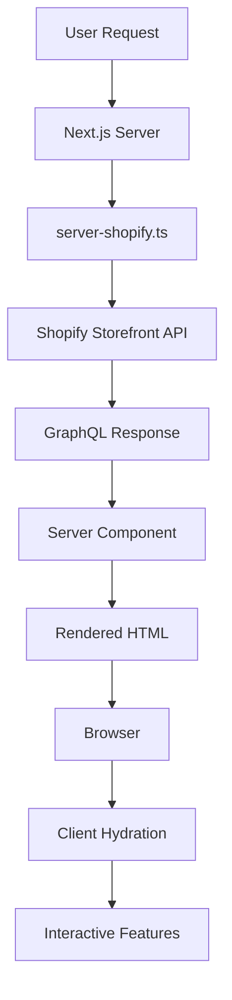

# Server-Side R### Server Components vs Client Components

The application now follows this pattern:

```
Server Components (Data Fetching)
├── FeaturedProducts.tsx        // Fetches products server-side
├── FeaturedCollections.tsx     // Fetches collections server-side
├── ProductPage ([handle]/page.tsx)   // Fetches single product server-side
└── CollectionPage ([handle]/page.tsx) // Fetches collection products server-side

Client Components (Interactivity)
├── AddToCartButton.tsx               // Cart interactions
├── CartSidebar.tsx                   // Cart UI and state
├── AuthModal.tsx                     // Authentication UI
└── Header.tsx                        // Navigation and user interactions
```

### Library Structure

The Shopify integration is split into two distinct libraries:

```
Shopify Libraries
├── /src/lib/server-shopify.ts        // Server-side data fetching (no NEXT_PUBLIC_ vars)
└── /src/lib/client-shopify.ts        // Client-side operations (requires NEXT_PUBLIC_ vars)
```

**Key Differences:**

- **server-shopify.ts**: Uses environment variables without `NEXT_PUBLIC_` prefix, runs only on server
- **client-shopify.ts**: Uses `NEXT_PUBLIC_` environment variables, can run in browser

### Server-Side Data Fetchingtion

This document explains how the application uses Next.js server-side rendering (SSR) and server components for optimal performance and SEO.

## Overview

The application uses server components to fetch data from Shopify on the server, providing several key benefits:

- **Better SEO**: Search engines can crawl fully rendered HTML with product data
- **Improved Performance**: Faster initial page loads as data is fetched on the server
- **Reduced Client Bundle**: Product fetching logic no longer needs to be shipped to the client
- **Better UX**: Users see content immediately instead of loading states for data fetching

## Architecture

### Server Components vs Client Components

The application follows this pattern:

```
Server Components (Data Fetching)
├── FeaturedProducts.tsx        // Fetches products server-side
├── FeaturedCollections.tsx     // Fetches collections server-side
├── ProductPage ([handle]/page.tsx)   // Fetches single product server-side
└── CollectionPage ([handle]/page.tsx) // Fetches collection products server-side

Client Components (Interactivity)
├── AddToCartButton.tsx               // Cart interactions
├── CartSidebar.tsx                   // Cart UI and state
├── AuthModal.tsx                     // Authentication UI
└── Header.tsx                        // Navigation and user interactions
```

### Server-Side Data Fetching

#### 1. Server Shopify Client (`/src/lib/server-shopify.ts`)

This module provides server-side functions to fetch data from Shopify:

```typescript
// Server-side data fetching functions
export async function getFeaturedProducts(
  count: number = 8
): Promise<Product[]>;
export async function getFeaturedCollections(
  count: number = 6
): Promise<Collection[]>;
export async function getProductByHandle(
  handle: string
): Promise<Product | null>;
export async function getCollectionByHandle(
  handle: string
): Promise<Collection | null>;
```

**Key Features:**

- Uses GraphQL client configured for server-side execution
- No authentication required for public storefront data
- Comprehensive error handling with fallbacks
- Optimized GraphQL queries for performance

#### 2. Server Components

**FeaturedProducts Component:**

- Fetches best-selling products server-side
- Renders immediately without client-side loading states
- Includes comprehensive product data for SEO

**FeaturedCollections Component:**

- Fetches collections with preview products
- Server-side rendering for better performance
- Rich metadata for search engines

### Page-Level Server Components

#### Product Pages (`/app/products/[handle]/page.tsx`)

```typescript
export default async function ProductPage({ params }: ProductPageProps) {
  const product = await getProductByHandle(params.handle);
  // Server-side rendering with full product data
}

export async function generateMetadata({
  params,
}: ProductPageProps): Promise<Metadata> {
  // SEO metadata generated server-side
}
```

**Benefits:**

- Full product data available on initial page load
- SEO-optimized with proper meta tags
- Better performance for product discovery
- Supports dynamic Open Graph images

#### Collection Pages (`/app/collections/[handle]/page.tsx`)

```typescript
export default async function CollectionPage({ params }: CollectionPageProps) {
  const collection = await getCollectionByHandle(params.handle);
  // Server-side rendering with all collection products
}
```

**Benefits:**

- Complete product catalog rendered server-side
- Better SEO for collection pages
- Faster navigation between collections

### Suspense and Loading States

The application uses React Suspense to provide smooth loading experiences:

```typescript
<Suspense fallback={<ProductsLoading />}>
  <FeaturedProducts />
</Suspense>
```

**Loading Components:**

- `ProductsLoading`: Skeleton UI for product grids
- `CollectionsLoading`: Skeleton UI for collection grids
- Enhanced loading states with proper styling and animation

### Environment Configuration

The application uses two sets of environment variables:

**Server-side only (not exposed to browser):**

```env
SHOPIFY_STORE_DOMAIN=your-store.myshopify.com
SHOPIFY_STOREFRONT_PRIVATE_ACCESS_TOKEN=your_private_storefront_token
SHOPIFY_CUSTOMER_ACCOUNT_API_CLIENT_ID=your_client_id
SHOPIFY_CUSTOMER_ACCOUNT_API_URL=https://shopify.com/your-api-url
```

**Client-side (only safe public configs):**

```env
NEXT_PUBLIC_APP_URL=http://localhost:3000
```

**Note**: All Shopify credentials are now server-side only for enhanced security.

**Security Note:**

- Server-side variables are never exposed to the browser
- Client-side variables are bundled into the JavaScript and visible to users
- Both sets use public Storefront API tokens for public product data
- Private operations use authenticated client-side components

## Performance Benefits

### Before (Client-Side Rendering)

1. User visits page
2. Browser downloads JavaScript bundle
3. React renders loading state
4. Client makes API call to Shopify
5. Data loads and components re-render

### After (Server-Side Rendering)

1. User visits page
2. Server fetches data from Shopify
3. Server renders complete HTML
4. Browser receives fully rendered page
5. Interactive elements hydrate

### Metrics Improvements

- **First Contentful Paint (FCP)**: Faster by eliminating client-side data fetching
- **Largest Contentful Paint (LCP)**: Improved as product images and content render immediately
- **Cumulative Layout Shift (CLS)**: Reduced as content doesn't shift after loading
- **SEO Score**: Better as search engines see complete content

## Data Flow



## Best Practices Implemented

### 1. Separation of Concerns

- **Server Components**: Data fetching and static rendering
- **Client Components**: User interactions and state management

### 2. Error Handling

- Graceful fallbacks for failed API calls
- Proper error boundaries and not-found pages
- Loading states during server-side rendering

### 3. Performance Optimization

- Minimal client-side JavaScript for data fetching
- Optimized GraphQL queries with only required fields
- Image optimization with Next.js Image component

### 4. SEO Optimization

- Server-side metadata generation
- Complete product data in initial HTML
- Proper Open Graph and Twitter card support

### 5. Type Safety

- Full TypeScript support for server and client components
- Proper typing for Shopify API responses
- Type-safe routing and parameters

## Migration Guide

If you need to create additional server components:

### 1. Create Server Component

```typescript
// components/sections/MyServerComponent.tsx
import { getMyData } from "@/lib/server-shopify";

export default async function MyServerComponent() {
  const data = await getMyData();
  return <div>{/* Render data */}</div>;
}
```

### 2. Add to Page

```typescript
// app/my-page/page.tsx
import { Suspense } from "react";
import MyServerComponent from "@/components/sections/MyServerComponent";

export default function MyPage() {
  return (
    <Suspense fallback={<div>Loading...</div>}>
      <MyServerComponent />
    </Suspense>
  );
}
```

### 3. Add Data Fetching Function

```typescript
// lib/server-shopify.ts
export async function getMyData(): Promise<MyData[]> {
  try {
    const response = await serverShopifyClient.request(MY_QUERY);
    return response.data;
  } catch (error) {
    console.error("Error fetching data:", error);
    return [];
  }
}
```

## Monitoring and Debugging

### Server-Side Logging

- All server-side errors are logged with context
- GraphQL query performance can be monitored
- Server-side rendering times are trackable

### Client-Side Hydration

- Interactive components hydrate seamlessly
- No hydration mismatches due to proper server/client separation

This server-side rendering implementation provides a solid foundation for a high-performance, SEO-friendly Shopify storefront while maintaining the interactive features users expect.
